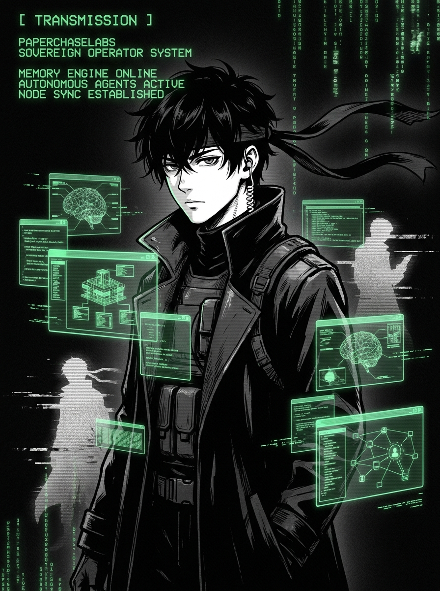

<p align="center">
  
</p>

<p align="center">
  <strong>[ TRANSMISSION SIGNED BY PAPERCHASELABS ]</strong><br/>
  <code>FREQ 140.85 · CH 401 · CLI</code><br/>
  <a href="https://paperchaselabs.com">paperchaselabs.com</a>
</p>

# PaperChase

> **The Sovereign Operator System.** Autonomous AI operator CLI — Claude-Code-style REPL meets Hermes-class autonomous loop. Memory engine, multi-agent dispatch, MCP server, skill registry. Operator-owned. Sovereign by default. MIT.

```bash
pip install paperchase
paperchase
```

Built by [PaperChaseLabs](https://paperchaselabs.com).

---

## Install

```bash
# canonical
pip install paperchase

# zero-install one-shot
uvx paperchase

# js world
npx paperchase

# macOS one-line
brew install chasewebb/paperchase/paperchase
```

## Quickstart

```bash
# Interactive REPL with Ollama (free, local)
paperchase chat

# Autonomous loop — agent plans, executes, self-critiques
paperchase auto "summarize the readme of https://github.com/openai/openai-python"

# Run as an MCP server
paperchase serve --mcp-stdio

# Install a skill
paperchase skill install builtin:web-research

# What runtimes are wired up
paperchase status
```

## Architecture

[ Diagram coming in PHASE 1 ]

## Skills

PaperChase ships with one reference skill (`web-research`). Skills are pluggable abilities the agent can absorb and switch between like modes. See [docs/SKILLS.md](docs/SKILLS.md).

## MCP integration

Drop this into `~/Library/Application Support/Claude/claude_desktop_config.json`:

```json
{
  "mcpServers": {
    "paperchase": {
      "command": "paperchase",
      "args": ["serve", "--mcp-stdio"]
    }
  }
}
```

## Roadmap → v0.2

- Multi-agent dispatch
- Skill marketplace
- Voice in/out
- Telegram / Discord / Slack adapters
- Self-fine-tune loop

## Links

- Lab — https://paperchaselabs.com
- Discord — https://discord.gg/5vYFCcKVrB
- Substack — https://substack.com/@paperchase
- Book a call — https://calendly.com/paperchasewebb/15min

---

<p align="center">
  
</p>

<p align="center">
  <sub>PAPERCHASEWEBB INC. · BUILT IN HONOLULU · 2018→</sub>
</p>
